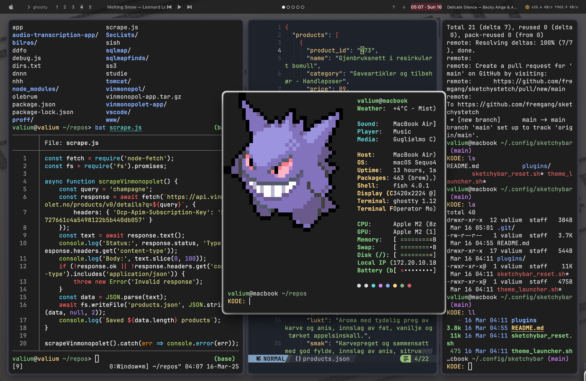

# Minimal Sketchybar Configuration

A clean, elegant, and minimal sketchybar configuration for macOS with multiple themes, responsive workspace indicators, and essential system information.



## Overview

This configuration creates a sleek, unobtrusive status bar with carefully designed modules:

- **Left**: Apple logo and current application name
- **Center**: Workspace indicators with dot visualization (●○○○○)
- **Right**: Network speeds, current music track, and date/time display

The design focuses on minimalism with subtle color accents and high readability.

## Features

- **Clean, Minimal Design**: Subtle background modules with careful spacing
- **Multiple Color Themes**: 
  - Dark (default): Monochromatic dark theme
  - Dark Egg: Warm amber accents on dark background
  - Dark Pink: Subtle pink accents on dark background
  - Après Ski: Cool blue accents on dark background
- **Workspace Indicators**: Visual dot indicators that update with keyboard shortcuts
- **Music Display**: Clean track and artist information when music is playing
- **Network Monitoring**: Real-time upload/download speeds
- **Date and Time**: Elegantly formatted datetime display

## Requirements

- macOS
- [sketchybar](https://github.com/FelixKratz/SketchyBar)
- [aerospace](https://github.com/nikitabobko/aerospace) (or yabai, skhd, or similar for workspace management)
- SF Pro font (included with macOS)

## Installation

1. Install sketchybar if you haven't already:
   ```bash
   brew tap FelixKratz/formulae
   brew install sketchybar


## Get

git clone https://github.com/yourusername/sketchybar-config.git

## Check for folders and move files

mkdir -p ~/.config/sketchybar/plugins
cp sketchybar/sketchybar_reset.sh ~/.config/sketchybar/
cp sketchybar/theme_launcher.sh ~/.config/sketchybar/
cp sketchybar/plugins/*.sh ~/.config/sketchybar/plugins/date.sh

chmod +x ~/.config/sketchybar/sketchybar_reset.sh
chmod +x ~/.config/sketchybar/theme_launcher.sh
chmod +x ~/.config/sketchybar/plugins/*.sh

## Create a simple sketchybarrc file

echo '#!/bin/bash' > ~/.config/sketchybar/sketchybarrc
echo 'source "$HOME/.config/sketchybar/sketchybar_reset.sh"' >> ~/.config/sketchybar/sketchybarrc
chmod +x ~/.config/sketchybar/sketchybarrc

## Start Sketchybar

brew services start sketchybar

# SKHD-integrationn

## Workspace switching with sketchybar notifications

cmd - 1 : aerospace workspace 1 && sketchybar --trigger aerospace_workspace_change space=1
cmd - 2 : aerospace workspace 2 && sketchybar --trigger aerospace_workspace_change space=2
cmd - 3 : aerospace workspace 3 && sketchybar --trigger aerospace_workspace_change space=3
cmd - 4 : aerospace workspace 4 && sketchybar --trigger aerospace_workspace_change space=4
cmd - 5 : aerospace workspace 5 && sketchybar --trigger aerospace_workspace_change space=5
cmd - 6 : aerospace workspace 6 && sketchybar --trigger aerospace_workspace_change space=6
cmd - 7 : aerospace workspace 7 && sketchybar --trigger aerospace_workspace_change space=7
cmd - 8 : aerospace workspace 8 && sketchybar --trigger aerospace_workspace_change space=8
cmd - 9 : aerospace workspace 9 && sketchybar --trigger aerospace_workspace_change space=9

### Changing theme

You can switch between themes using the theme launcher:

bash ~/.config/sketchybar/theme_launcher.sh
Or specify a theme directly.

## Structure

sketchybar_reset.sh: Main configuration script
theme_launcher.sh: Interactive theme selector
plugins/: Directory containing item scripts

workspaces.sh: Handles workspace indicator updates
front_app.sh: Updates current application name
network_speed.sh: Monitors and formats network speeds
datetime.sh: Formats date and time display
music_info.sh: Gets and formats current music track info
